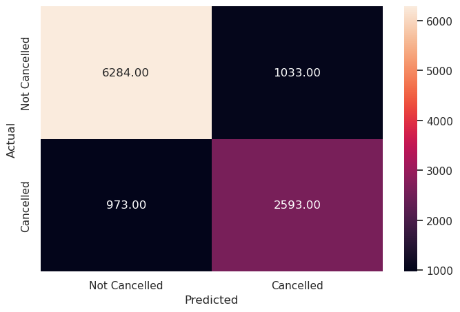

# **Project - Classification and Hypothesis Testing: Hotel Booking Cancellation Prediction**

## **Marks: 40**

---------------
## **Problem Statement**

### **Context**

**A significant number of hotel bookings are called off due to cancellations or no-shows.** Typical reasons for cancellations include change of plans, scheduling conflicts, etc. This is often made easier by the option to do so free of charge or preferably at a low cost. This may be beneficial to hotel guests, but it is a less desirable and possibly revenue-diminishing factor for hotels to deal with. Such losses are particularly high on last-minute cancellations.

The new technologies involving online booking channels have dramatically changed customers’ booking possibilities and behavior. This adds a further dimension to the challenge of how hotels handle cancellations, which are no longer limited to traditional booking and guest characteristics.

This pattern of cancellations of bookings impacts a hotel on various fronts:
1. **Loss of resources (revenue)** when the hotel cannot resell the room.
2. **Additional costs of distribution channels** by increasing commissions or paying for publicity to help sell these rooms.
3. **Lowering prices last minute**, so the hotel can resell a room, resulting in reducing the profit margin.
4. **Human resources to make arrangements** for the guests.

### **Objective**

This increasing number of cancellations calls for a Machine Learning based solution that can help in predicting which booking is likely to be canceled. INN Hotels Group has a chain of hotels in Portugal - they are facing problems with this high number of booking cancellations and have reached out to your firm for data-driven solutions. You, as a Data Scientist, have to analyze the data provided to find which factors have a high influence on booking cancellations, build a predictive model that can predict which booking is going to be canceled in advance, and help in formulating profitable policies for cancellations and refunds.


### **Data Description**

The data contains the different attributes of customers' booking details. The detailed data dictionary is given below:


**Data Dictionary**

* **Booking_ID:** Unique identifier of each booking
* **no_of_adults:** Number of adults
* **no_of_children:** Number of children
* **no_of_weekend_nights:** Number of weekend nights (Saturday or Sunday) the guest stayed or booked to stay at the hotel
* **no_of_week_nights:** Number of weekday nights (Monday to Friday) the guest stayed or booked to stay at the hotel
* **type_of_meal_plan:** Type of meal plan booked by the customer:
    * Not Selected – No meal plan selected
    * Meal Plan 1 – Breakfast
    * Meal Plan 2 – Half board (breakfast and one other meal)
    * Meal Plan 3 – Full board (breakfast, lunch, and dinner)
* **required_car_parking_space:** Does the customer require a car parking space? (0 - No, 1- Yes)
* **room_type_reserved:** Type of room reserved by the customer. The values are ciphered (encoded) by INN Hotels.
* **lead_time:** Number of days between the date of booking and the arrival date
* **arrival_year:** Year of arrival date
* **arrival_month:** Month of arrival date
* **arrival_date:** Date of the month
* **market_segment_type:** Market segment designation.
* **repeated_guest:** Is the customer a repeated guest? (0 - No, 1- Yes)
* **no_of_previous_cancellations:** Number of previous bookings that were canceled by the customer prior to the current booking
* **no_of_previous_bookings_not_canceled:** Number of previous bookings not canceled by the customer prior to the current booking
* **avg_price_per_room:** Average price per day of the reservation; prices of the rooms are dynamic. (in euros)
* **no_of_special_requests:** Total number of special requests made by the customer (e.g. high floor, view from the room, etc)
* **booking_status:** Flag indicating if the booking was canceled or not.

## **Importing the libraries required**


```python
# Importing the basic libraries we will require for the project

# Libraries to help with reading and manipulating data
import pandas as pd
import numpy as np

# Libaries to help with data visualization
import matplotlib.pyplot as plt
import seaborn as sns
sns.set()

# Importing the Machine Learning models we require from Scikit-Learn
from sklearn.linear_model import LogisticRegression
from sklearn.svm import SVC
from sklearn.tree import DecisionTreeClassifier
from sklearn import tree
from sklearn.ensemble import RandomForestClassifier

# Importing the other functions we may require from Scikit-Learn
from sklearn.model_selection import train_test_split, GridSearchCV
from sklearn.preprocessing import MinMaxScaler, LabelEncoder, OneHotEncoder

# To get diferent metric scores
from sklearn.metrics import confusion_matrix,classification_report,roc_auc_score,plot_confusion_matrix,precision_recall_curve,roc_curve,make_scorer

# Code to ignore warnings from function usage
import warnings;
import numpy as np
warnings.filterwarnings('ignore')
```

## **Loading the dataset**


```python
hotel = pd.read_csv("INNHotelsGroup.csv")
```


```python
# Copying data to another variable to avoid any changes to original data
data = hotel.copy()
```

## **Overview of the dataset**

### **View the first and last 5 rows of the dataset**

Let's **view the first few rows and last few rows** of the dataset in order to understand its structure a little better.

We will use the head() and tail() methods from Pandas to do this.


```python
data.head()
```


<div>
<style scoped>
    .dataframe tbody tr th:only-of-type {
        vertical-align: middle;
    }

    .dataframe tbody tr th {
        vertical-align: top;
    }

    .dataframe thead th {
        text-align: right;
    }
</style>
<table border="1" class="dataframe">
  <thead>
    <tr style="text-align: right;">
      <th></th>
      <th>Booking_ID</th>
      <th>no_of_adults</th>
      <th>no_of_children</th>
      <th>no_of_weekend_nights</th>
      <th>no_of_week_nights</th>
      <th>type_of_meal_plan</th>
      <th>required_car_parking_space</th>
      <th>room_type_reserved</th>
      <th>lead_time</th>
      <th>arrival_year</th>
      <th>arrival_month</th>
      <th>arrival_date</th>
      <th>market_segment_type</th>
      <th>repeated_guest</th>
      <th>no_of_previous_cancellations</th>
      <th>no_of_previous_bookings_not_canceled</th>
      <th>avg_price_per_room</th>
      <th>no_of_special_requests</th>
      <th>booking_status</th>
    </tr>
  </thead>
  <tbody>
    <tr>
      <th>0</th>
      <td>INN00001</td>
      <td>2</td>
      <td>0</td>
      <td>1</td>
      <td>2</td>
      <td>Meal Plan 1</td>
      <td>0</td>
      <td>Room_Type 1</td>
      <td>224</td>
      <td>2017</td>
      <td>10</td>
      <td>2</td>
      <td>Offline</td>
      <td>0</td>
      <td>0</td>
      <td>0</td>
      <td>65.00</td>
      <td>0</td>
      <td>Not_Canceled</td>
    </tr>
    <tr>
      <th>1</th>
      <td>INN00002</td>
      <td>2</td>
      <td>0</td>
      <td>2</td>
      <td>3</td>
      <td>Not Selected</td>
      <td>0</td>
      <td>Room_Type 1</td>
      <td>5</td>
      <td>2018</td>
      <td>11</td>
      <td>6</td>
      <td>Online</td>
      <td>0</td>
      <td>0</td>
      <td>0</td>
      <td>106.68</td>
      <td>1</td>
      <td>Not_Canceled</td>
    </tr>
    <tr>
      <th>2</th>
      <td>INN00003</td>
      <td>1</td>
      <td>0</td>
      <td>2</td>
      <td>1</td>
      <td>Meal Plan 1</td>
      <td>0</td>
      <td>Room_Type 1</td>
      <td>1</td>
      <td>2018</td>
      <td>2</td>
      <td>28</td>
      <td>Online</td>
      <td>0</td>
      <td>0</td>
      <td>0</td>
      <td>60.00</td>
      <td>0</td>
      <td>Canceled</td>
    </tr>
    <tr>
      <th>3</th>
      <td>INN00004</td>
      <td>2</td>
      <td>0</td>
      <td>0</td>
      <td>2</td>
      <td>Meal Plan 1</td>
      <td>0</td>
      <td>Room_Type 1</td>
      <td>211</td>
      <td>2018</td>
      <td>5</td>
      <td>20</td>
      <td>Online</td>
      <td>0</td>
      <td>0</td>
      <td>0</td>
      <td>100.00</td>
      <td>0</td>
      <td>Canceled</td>
    </tr>
    <tr>
      <th>4</th>
      <td>INN00005</td>
      <td>2</td>
      <td>0</td>
      <td>1</td>
      <td>1</td>
      <td>Not Selected</td>
      <td>0</td>
      <td>Room_Type 1</td>
      <td>48</td>
      <td>2018</td>
      <td>4</td>
      <td>11</td>
      <td>Online</td>
      <td>0</td>
      <td>0</td>
      <td>0</td>
      <td>94.50</td>
      <td>0</td>
      <td>Canceled</td>
    </tr>
  </tbody>
</table>
</div>


```python
data.tail()
```


<div>
<style scoped>
    .dataframe tbody tr th:only-of-type {
        vertical-align: middle;
    }

    .dataframe tbody tr th {
        vertical-align: top;
    }

    .dataframe thead th {
        text-align: right;
    }
</style>
<table border="1" class="dataframe">
  <thead>
    <tr style="text-align: right;">
      <th></th>
      <th>Booking_ID</th>
      <th>no_of_adults</th>
      <th>no_of_children</th>
      <th>no_of_weekend_nights</th>
      <th>no_of_week_nights</th>
      <th>type_of_meal_plan</th>
      <th>required_car_parking_space</th>
      <th>room_type_reserved</th>
      <th>lead_time</th>
      <th>arrival_year</th>
      <th>arrival_month</th>
      <th>arrival_date</th>
      <th>market_segment_type</th>
      <th>repeated_guest</th>
      <th>no_of_previous_cancellations</th>
      <th>no_of_previous_bookings_not_canceled</th>
      <th>avg_price_per_room</th>
      <th>no_of_special_requests</th>
      <th>booking_status</th>
    </tr>
  </thead>
  <tbody>
    <tr>
      <th>36270</th>
      <td>INN36271</td>
      <td>3</td>
      <td>0</td>
      <td>2</td>
      <td>6</td>
      <td>Meal Plan 1</td>
      <td>0</td>
      <td>Room_Type 4</td>
      <td>85</td>
      <td>2018</td>
      <td>8</td>
      <td>3</td>
      <td>Online</td>
      <td>0</td>
      <td>0</td>
      <td>0</td>
      <td>167.80</td>
      <td>1</td>
      <td>Not_Canceled</td>
    </tr>
    <tr>
      <th>36271</th>
      <td>INN36272</td>
      <td>2</td>
      <td>0</td>
      <td>1</td>
      <td>3</td>
      <td>Meal Plan 1</td>
      <td>0</td>
      <td>Room_Type 1</td>
      <td>228</td>
      <td>2018</td>
      <td>10</td>
      <td>17</td>
      <td>Online</td>
      <td>0</td>
      <td>0</td>
      <td>0</td>
      <td>90.95</td>
      <td>2</td>
      <td>Canceled</td>
    </tr>
    <tr>
      <th>36272</th>
      <td>INN36273</td>
      <td>2</td>
      <td>0</td>
      <td>2</td>
      <td>6</td>
      <td>Meal Plan 1</td>
      <td>0</td>
      <td>Room_Type 1</td>
      <td>148</td>
      <td>2018</td>
      <td>7</td>
      <td>1</td>
      <td>Online</td>
      <td>0</td>
      <td>0</td>
      <td>0</td>
      <td>98.39</td>
      <td>2</td>
      <td>Not_Canceled</td>
    </tr>
    <tr>
      <th>36273</th>
      <td>INN36274</td>
      <td>2</td>
      <td>0</td>
      <td>0</td>
      <td>3</td>
      <td>Not Selected</td>
      <td>0</td>
      <td>Room_Type 1</td>
      <td>63</td>
      <td>2018</td>
      <td>4</td>
      <td>21</td>
      <td>Online</td>
      <td>0</td>
      <td>0</td>
      <td>0</td>
      <td>94.50</td>
      <td>0</td>
      <td>Canceled</td>
    </tr>
    <tr>
      <th>36274</th>
      <td>INN36275</td>
      <td>2</td>
      <td>0</td>
      <td>1</td>
      <td>2</td>
      <td>Meal Plan 1</td>
      <td>0</td>
      <td>Room_Type 1</td>
      <td>207</td>
      <td>2018</td>
      <td>12</td>
      <td>30</td>
      <td>Offline</td>
      <td>0</td>
      <td>0</td>
      <td>0</td>
      <td>161.67</td>
      <td>0</td>
      <td>Not_Canceled</td>
    </tr>
  </tbody>
</table>
</div>


### **Understand the shape of the dataset**


```python
data.shape
```


    (36275, 19)


* The dataset has 36275 rows and 19 columns. 

### **Check the data types of the columns for the dataset**


```python
data.info()
```

    <class 'pandas.core.frame.DataFrame'>
    RangeIndex: 36275 entries, 0 to 36274
    Data columns (total 19 columns):
     #   Column                                Non-Null Count  Dtype  
    ---  ------                                --------------  -----  
     0   Booking_ID                            36275 non-null  object 
     1   no_of_adults                          36275 non-null  int64  
     2   no_of_children                        36275 non-null  int64  
     3   no_of_weekend_nights                  36275 non-null  int64  
     4   no_of_week_nights                     36275 non-null  int64  
     5   type_of_meal_plan                     36275 non-null  object 
     6   required_car_parking_space            36275 non-null  int64  
     7   room_type_reserved                    36275 non-null  object 
     8   lead_time                             36275 non-null  int64  
     9   arrival_year                          36275 non-null  int64  
     10  arrival_month                         36275 non-null  int64  
     11  arrival_date                          36275 non-null  int64  
     12  market_segment_type                   36275 non-null  object 
     13  repeated_guest                        36275 non-null  int64  
     14  no_of_previous_cancellations          36275 non-null  int64  
     15  no_of_previous_bookings_not_canceled  36275 non-null  int64  
     16  avg_price_per_room                    36275 non-null  float64
     17  no_of_special_requests                36275 non-null  int64  
     18  booking_status                        36275 non-null  object 
    dtypes: float64(1), int64(13), object(5)
    memory usage: 5.3+ MB


* `Booking_ID`, `type_of_meal_plan`, `room_type_reserved`, `market_segment_type`, and `booking_status` are of object type while rest columns are numeric in nature.

* There are no null values in the dataset.

### **Dropping duplicate values**


```python
# checking for duplicate values
data.duplicated().sum()
```


    0


- There are **no duplicate values** in the data.

### **Dropping the unique values column**

**Let's drop the Booking_ID column first before we proceed forward**, as a column with unique values will have almost no predictive power for the Machine Learning problem at hand.


```python
data = data.drop(["Booking_ID"], axis=1)
```


```python
data.head()
```


<div>
<style scoped>
    .dataframe tbody tr th:only-of-type {
        vertical-align: middle;
    }

    .dataframe tbody tr th {
        vertical-align: top;
    }

    .dataframe thead th {
        text-align: right;
    }
</style>
<table border="1" class="dataframe">
  <thead>
    <tr style="text-align: right;">
      <th></th>
      <th>no_of_adults</th>
      <th>no_of_children</th>
      <th>no_of_weekend_nights</th>
      <th>no_of_week_nights</th>
      <th>type_of_meal_plan</th>
      <th>required_car_parking_space</th>
      <th>room_type_reserved</th>
      <th>lead_time</th>
      <th>arrival_year</th>
      <th>arrival_month</th>
      <th>arrival_date</th>
      <th>market_segment_type</th>
      <th>repeated_guest</th>
      <th>no_of_previous_cancellations</th>
      <th>no_of_previous_bookings_not_canceled</th>
      <th>avg_price_per_room</th>
      <th>no_of_special_requests</th>
      <th>booking_status</th>
    </tr>
  </thead>
  <tbody>
    <tr>
      <th>0</th>
      <td>2</td>
      <td>0</td>
      <td>1</td>
      <td>2</td>
      <td>Meal Plan 1</td>
      <td>0</td>
      <td>Room_Type 1</td>
      <td>224</td>
      <td>2017</td>
      <td>10</td>
      <td>2</td>
      <td>Offline</td>
      <td>0</td>
      <td>0</td>
      <td>0</td>
      <td>65.00</td>
      <td>0</td>
      <td>Not_Canceled</td>
    </tr>
    <tr>
      <th>1</th>
      <td>2</td>
      <td>0</td>
      <td>2</td>
      <td>3</td>
      <td>Not Selected</td>
      <td>0</td>
      <td>Room_Type 1</td>
      <td>5</td>
      <td>2018</td>
      <td>11</td>
      <td>6</td>
      <td>Online</td>
      <td>0</td>
      <td>0</td>
      <td>0</td>
      <td>106.68</td>
      <td>1</td>
      <td>Not_Canceled</td>
    </tr>
    <tr>
      <th>2</th>
      <td>1</td>
      <td>0</td>
      <td>2</td>
      <td>1</td>
      <td>Meal Plan 1</td>
      <td>0</td>
      <td>Room_Type 1</td>
      <td>1</td>
      <td>2018</td>
      <td>2</td>
      <td>28</td>
      <td>Online</td>
      <td>0</td>
      <td>0</td>
      <td>0</td>
      <td>60.00</td>
      <td>0</td>
      <td>Canceled</td>
    </tr>
    <tr>
      <th>3</th>
      <td>2</td>
      <td>0</td>
      <td>0</td>
      <td>2</td>
      <td>Meal Plan 1</td>
      <td>0</td>
      <td>Room_Type 1</td>
      <td>211</td>
      <td>2018</td>
      <td>5</td>
      <td>20</td>
      <td>Online</td>
      <td>0</td>
      <td>0</td>
      <td>0</td>
      <td>100.00</td>
      <td>0</td>
      <td>Canceled</td>
    </tr>
    <tr>
      <th>4</th>
      <td>2</td>
      <td>0</td>
      <td>1</td>
      <td>1</td>
      <td>Not Selected</td>
      <td>0</td>
      <td>Room_Type 1</td>
      <td>48</td>
      <td>2018</td>
      <td>4</td>
      <td>11</td>
      <td>Online</td>
      <td>0</td>
      <td>0</td>
      <td>0</td>
      <td>94.50</td>
      <td>0</td>
      <td>Canceled</td>
    </tr>
  </tbody>
</table>
</div>


### **Question 1: Check the summary statistics of the dataset and write your observations (2 Marks)**


**Let's check the statistical summary of the data.**


```python
# Remove _________ and complete the code
data.describe().T
```


<div>
<style scoped>
    .dataframe tbody tr th:only-of-type {
        vertical-align: middle;
    }

    .dataframe tbody tr th {
        vertical-align: top;
    }

    .dataframe thead th {
        text-align: right;
    }
</style>
<table border="1" class="dataframe">
  <thead>
    <tr style="text-align: right;">
      <th></th>
      <th>count</th>
      <th>mean</th>
      <th>std</th>
      <th>min</th>
      <th>25%</th>
      <th>50%</th>
      <th>75%</th>
      <th>max</th>
    </tr>
  </thead>
  <tbody>
    <tr>
      <th>no_of_adults</th>
      <td>36275.0</td>
      <td>1.844962</td>
      <td>0.518715</td>
      <td>0.0</td>
      <td>2.0</td>
      <td>2.00</td>
      <td>2.0</td>
      <td>4.0</td>
    </tr>
    <tr>
      <th>no_of_children</th>
      <td>36275.0</td>
      <td>0.105279</td>
      <td>0.402648</td>
      <td>0.0</td>
      <td>0.0</td>
      <td>0.00</td>
      <td>0.0</td>
      <td>10.0</td>
    </tr>
    <tr>
      <th>no_of_weekend_nights</th>
      <td>36275.0</td>
      <td>0.810724</td>
      <td>0.870644</td>
      <td>0.0</td>
      <td>0.0</td>
      <td>1.00</td>
      <td>2.0</td>
      <td>7.0</td>
    </tr>
    <tr>
      <th>no_of_week_nights</th>
      <td>36275.0</td>
      <td>2.204300</td>
      <td>1.410905</td>
      <td>0.0</td>
      <td>1.0</td>
      <td>2.00</td>
      <td>3.0</td>
      <td>17.0</td>
    </tr>
    <tr>
      <th>required_car_parking_space</th>
      <td>36275.0</td>
      <td>0.030986</td>
      <td>0.173281</td>
      <td>0.0</td>
      <td>0.0</td>
      <td>0.00</td>
      <td>0.0</td>
      <td>1.0</td>
    </tr>
    <tr>
      <th>lead_time</th>
      <td>36275.0</td>
      <td>85.232557</td>
      <td>85.930817</td>
      <td>0.0</td>
      <td>17.0</td>
      <td>57.00</td>
      <td>126.0</td>
      <td>443.0</td>
    </tr>
    <tr>
      <th>arrival_year</th>
      <td>36275.0</td>
      <td>2017.820427</td>
      <td>0.383836</td>
      <td>2017.0</td>
      <td>2018.0</td>
      <td>2018.00</td>
      <td>2018.0</td>
      <td>2018.0</td>
    </tr>
    <tr>
      <th>arrival_month</th>
      <td>36275.0</td>
      <td>7.423653</td>
      <td>3.069894</td>
      <td>1.0</td>
      <td>5.0</td>
      <td>8.00</td>
      <td>10.0</td>
      <td>12.0</td>
    </tr>
    <tr>
      <th>arrival_date</th>
      <td>36275.0</td>
      <td>15.596995</td>
      <td>8.740447</td>
      <td>1.0</td>
      <td>8.0</td>
      <td>16.00</td>
      <td>23.0</td>
      <td>31.0</td>
    </tr>
    <tr>
      <th>repeated_guest</th>
      <td>36275.0</td>
      <td>0.025637</td>
      <td>0.158053</td>
      <td>0.0</td>
      <td>0.0</td>
      <td>0.00</td>
      <td>0.0</td>
      <td>1.0</td>
    </tr>
    <tr>
      <th>no_of_previous_cancellations</th>
      <td>36275.0</td>
      <td>0.023349</td>
      <td>0.368331</td>
      <td>0.0</td>
      <td>0.0</td>
      <td>0.00</td>
      <td>0.0</td>
      <td>13.0</td>
    </tr>
    <tr>
      <th>no_of_previous_bookings_not_canceled</th>
      <td>36275.0</td>
      <td>0.153411</td>
      <td>1.754171</td>
      <td>0.0</td>
      <td>0.0</td>
      <td>0.00</td>
      <td>0.0</td>
      <td>58.0</td>
    </tr>
    <tr>
      <th>avg_price_per_room</th>
      <td>36275.0</td>
      <td>103.423539</td>
      <td>35.089424</td>
      <td>0.0</td>
      <td>80.3</td>
      <td>99.45</td>
      <td>120.0</td>
      <td>540.0</td>
    </tr>
    <tr>
      <th>no_of_special_requests</th>
      <td>36275.0</td>
      <td>0.619655</td>
      <td>0.786236</td>
      <td>0.0</td>
      <td>0.0</td>
      <td>0.00</td>
      <td>1.0</td>
      <td>5.0</td>
    </tr>
  </tbody>
</table>
</div>


**Write your answers here:**

- Number of children is imbalanced because most of the values are 0, even the third quartile is 0. There are definitely outliers with max value of 10. Therefore, most of the bookings are for single adults or couples (median for number of adults is 2) and few bookings for families.
- There are more bookings for week days instead of weekends. The number of week nights have some outliers (max value is 17 but third quartile is 3). They both have a minimum of zero nights, this could be associated with booking rooms only during the day and for some reasons not staying at night.
- It looks like most of the bookings do not require a car parking space.
- Lead time has a right-skewed distribution with outliers (mean is larger than the median, max value is 443 and third quartile is 126).
- Arrival year is between 2017 and 2018.
- Arrival month has the median in August.
- Arrival date is basically uniformly distributed.
- It is rare to have repeated guests.
- Previous cancellations has some outliers as the max value is 13 and third quartile is 0, same for previous bookings not canceled (max value 58, 75th percentile is 0). This has to do with the fact that there are really few repeated guests, and they are probably the outliers.
- Average price per room has some outliers (max value 540 against third quartile of 120). There might be some outliers also at the other end because the mean is on the order of the first quartile and the median (80-100) but the minimum value is 0. How can a room cost zero? We should explore this further.
- There are also some outliers for number of special requests.


## **Exploratory Data Analysis**

### **Question 2: Univariate Analysis**

Let's explore these variables in some more depth by observing their distributions.

We will first define a **hist_box() function** that provides both a boxplot and a histogram in the same visual, with which we can perform univariate analysis on the columns of this dataset.


```python
# Defining the hist_box() function
def hist_box(data,col):
  f, (ax_box, ax_hist) = plt.subplots(2, sharex=True, gridspec_kw={'height_ratios': (0.15, 0.85)}, figsize=(12,6))
  # Adding a graph in each part
  sns.boxplot(data[col], ax=ax_box, showmeans=True)
  sns.distplot(data[col], ax=ax_hist)
  plt.show()
```

#### **Question 2.1:  Plot the histogram and box plot for the variable `Lead Time` using the hist_box function provided and write your insights. (1 Mark)**


```python
# Remove _________ and complete the code
hist_box(data, "lead_time") 
```


    

    


**Write your answers here:**

- These plots confirm what we have described in the previous answer, the lead time distribution is right skewed as we can see from the boxplot (mean larger than the median) and the histogram.
- There are many outliers as we can see from the boxplot.

#### **Question 2.2:  Plot the histogram and box plot for the variable `Average Price per Room` using the hist_box function provided and write your insights. (1 Mark)**


```python
# Remove _________ and complete the code
hist_box(data, "avg_price_per_room")
```


    

    


**Write your answers here:**

- Average price per room has a slight right-skeweness.
- There are outliers at both ends, including a price of 0.

**Interestingly some rooms have a price equal to 0. Let's check them.**


```python
data[data["avg_price_per_room"] == 0]
```


<div>
<style scoped>
    .dataframe tbody tr th:only-of-type {
        vertical-align: middle;
    }

    .dataframe tbody tr th {
        vertical-align: top;
    }

    .dataframe thead th {
        text-align: right;
    }
</style>
<table border="1" class="dataframe">
  <thead>
    <tr style="text-align: right;">
      <th></th>
      <th>no_of_adults</th>
      <th>no_of_children</th>
      <th>no_of_weekend_nights</th>
      <th>no_of_week_nights</th>
      <th>type_of_meal_plan</th>
      <th>required_car_parking_space</th>
      <th>room_type_reserved</th>
      <th>lead_time</th>
      <th>arrival_year</th>
      <th>arrival_month</th>
      <th>arrival_date</th>
      <th>market_segment_type</th>
      <th>repeated_guest</th>
      <th>no_of_previous_cancellations</th>
      <th>no_of_previous_bookings_not_canceled</th>
      <th>avg_price_per_room</th>
      <th>no_of_special_requests</th>
      <th>booking_status</th>
    </tr>
  </thead>
  <tbody>
    <tr>
      <th>63</th>
      <td>1</td>
      <td>0</td>
      <td>0</td>
      <td>1</td>
      <td>Meal Plan 1</td>
      <td>0</td>
      <td>Room_Type 1</td>
      <td>2</td>
      <td>2017</td>
      <td>9</td>
      <td>10</td>
      <td>Complementary</td>
      <td>0</td>
      <td>0</td>
      <td>0</td>
      <td>0.0</td>
      <td>1</td>
      <td>Not_Canceled</td>
    </tr>
    <tr>
      <th>145</th>
      <td>1</td>
      <td>0</td>
      <td>0</td>
      <td>2</td>
      <td>Meal Plan 1</td>
      <td>0</td>
      <td>Room_Type 1</td>
      <td>13</td>
      <td>2018</td>
      <td>6</td>
      <td>1</td>
      <td>Complementary</td>
      <td>1</td>
      <td>3</td>
      <td>5</td>
      <td>0.0</td>
      <td>1</td>
      <td>Not_Canceled</td>
    </tr>
    <tr>
      <th>209</th>
      <td>1</td>
      <td>0</td>
      <td>0</td>
      <td>0</td>
      <td>Meal Plan 1</td>
      <td>0</td>
      <td>Room_Type 1</td>
      <td>4</td>
      <td>2018</td>
      <td>2</td>
      <td>27</td>
      <td>Complementary</td>
      <td>0</td>
      <td>0</td>
      <td>0</td>
      <td>0.0</td>
      <td>1</td>
      <td>Not_Canceled</td>
    </tr>
    <tr>
      <th>266</th>
      <td>1</td>
      <td>0</td>
      <td>0</td>
      <td>2</td>
      <td>Meal Plan 1</td>
      <td>0</td>
      <td>Room_Type 1</td>
      <td>1</td>
      <td>2017</td>
      <td>8</td>
      <td>12</td>
      <td>Complementary</td>
      <td>1</td>
      <td>0</td>
      <td>1</td>
      <td>0.0</td>
      <td>1</td>
      <td>Not_Canceled</td>
    </tr>
    <tr>
      <th>267</th>
      <td>1</td>
      <td>0</td>
      <td>2</td>
      <td>1</td>
      <td>Meal Plan 1</td>
      <td>0</td>
      <td>Room_Type 1</td>
      <td>4</td>
      <td>2017</td>
      <td>8</td>
      <td>23</td>
      <td>Complementary</td>
      <td>0</td>
      <td>0</td>
      <td>0</td>
      <td>0.0</td>
      <td>1</td>
      <td>Not_Canceled</td>
    </tr>
    <tr>
      <th>...</th>
      <td>...</td>
      <td>...</td>
      <td>...</td>
      <td>...</td>
      <td>...</td>
      <td>...</td>
      <td>...</td>
      <td>...</td>
      <td>...</td>
      <td>...</td>
      <td>...</td>
      <td>...</td>
      <td>...</td>
      <td>...</td>
      <td>...</td>
      <td>...</td>
      <td>...</td>
      <td>...</td>
    </tr>
    <tr>
      <th>35983</th>
      <td>1</td>
      <td>0</td>
      <td>0</td>
      <td>1</td>
      <td>Meal Plan 1</td>
      <td>0</td>
      <td>Room_Type 7</td>
      <td>0</td>
      <td>2018</td>
      <td>6</td>
      <td>7</td>
      <td>Complementary</td>
      <td>1</td>
      <td>4</td>
      <td>17</td>
      <td>0.0</td>
      <td>1</td>
      <td>Not_Canceled</td>
    </tr>
    <tr>
      <th>36080</th>
      <td>1</td>
      <td>0</td>
      <td>1</td>
      <td>1</td>
      <td>Meal Plan 1</td>
      <td>0</td>
      <td>Room_Type 7</td>
      <td>0</td>
      <td>2018</td>
      <td>3</td>
      <td>21</td>
      <td>Complementary</td>
      <td>1</td>
      <td>3</td>
      <td>15</td>
      <td>0.0</td>
      <td>1</td>
      <td>Not_Canceled</td>
    </tr>
    <tr>
      <th>36114</th>
      <td>1</td>
      <td>0</td>
      <td>0</td>
      <td>1</td>
      <td>Meal Plan 1</td>
      <td>0</td>
      <td>Room_Type 1</td>
      <td>1</td>
      <td>2018</td>
      <td>3</td>
      <td>2</td>
      <td>Online</td>
      <td>0</td>
      <td>0</td>
      <td>0</td>
      <td>0.0</td>
      <td>0</td>
      <td>Not_Canceled</td>
    </tr>
    <tr>
      <th>36217</th>
      <td>2</td>
      <td>0</td>
      <td>2</td>
      <td>1</td>
      <td>Meal Plan 1</td>
      <td>0</td>
      <td>Room_Type 2</td>
      <td>3</td>
      <td>2017</td>
      <td>8</td>
      <td>9</td>
      <td>Online</td>
      <td>0</td>
      <td>0</td>
      <td>0</td>
      <td>0.0</td>
      <td>2</td>
      <td>Not_Canceled</td>
    </tr>
    <tr>
      <th>36250</th>
      <td>1</td>
      <td>0</td>
      <td>0</td>
      <td>2</td>
      <td>Meal Plan 2</td>
      <td>0</td>
      <td>Room_Type 1</td>
      <td>6</td>
      <td>2017</td>
      <td>12</td>
      <td>10</td>
      <td>Online</td>
      <td>0</td>
      <td>0</td>
      <td>0</td>
      <td>0.0</td>
      <td>0</td>
      <td>Not_Canceled</td>
    </tr>
  </tbody>
</table>
<p>545 rows × 18 columns</p>
</div>


- There are quite a few hotel rooms which have a price equal to 0.
- In the market segment column, it looks like many values are complementary.


```python
data.loc[data["avg_price_per_room"] == 0, "market_segment_type"].value_counts()
```


    Complementary    354
    Online           191
    Name: market_segment_type, dtype: int64


* It makes sense that most values with room prices equal to 0 are the rooms given as complimentary service from the hotel.
* The rooms booked online must be a part of some promotional campaign done by the hotel.


```python
# Calculating the 25th quantile
Q1 = data["avg_price_per_room"].quantile(0.25)

# Calculating the 75th quantile
Q3 = data["avg_price_per_room"].quantile(0.75)

# Calculating IQR
IQR = Q3 - Q1

# Calculating value of upper whisker
Upper_Whisker = Q3 + 1.5 * IQR
Upper_Whisker
```


    179.55


```python
# assigning the outliers the value of upper whisker
data.loc[data["avg_price_per_room"] >= 500, "avg_price_per_room"] = Upper_Whisker
```

#### **Let's understand the distribution of the categorical variables**

**Number of Children**


```python
sns.countplot(data['no_of_children'])
plt.show()
```


    

    


```python
data['no_of_children'].value_counts(normalize=True)
```


    0     0.925624
    1     0.044604
    2     0.029166
    3     0.000524
    9     0.000055
    10    0.000028
    Name: no_of_children, dtype: float64


* Customers were not travelling with children in 93% of cases.
* There are some values in the data where the number of children is 9 or 10, which is highly unlikely. 
* We will replace these values with the maximum value of 3 children.


```python
# replacing 9, and 10 children with 3
data["no_of_children"] = data["no_of_children"].replace([9, 10], 3)
```

**Arrival Month**


```python
sns.countplot(data["arrival_month"])
plt.show()
```


    

    


```python
data['arrival_month'].value_counts(normalize=True)
```


    10    0.146575
    9     0.127112
    8     0.105114
    6     0.088298
    12    0.083280
    11    0.082150
    7     0.080496
    4     0.075424
    5     0.071620
    3     0.065003
    2     0.046975
    1     0.027953
    Name: arrival_month, dtype: float64


* October is the busiest month for hotel arrivals followed by September and August. **Over 35% of all bookings**, as we see in the above table, were for one of these three months.
* Around 14.7% of the bookings were made for an October arrival.

**Booking Status**


```python
sns.countplot(data["booking_status"])
plt.show()
```


    

    


```python
data['booking_status'].value_counts(normalize=True)
```


    Not_Canceled    0.672364
    Canceled        0.327636
    Name: booking_status, dtype: float64


* 32.8% of the bookings were canceled by the customers.

**Let's encode Canceled bookings to 1 and Not_Canceled as 0 for further analysis**


```python
data["booking_status"] = data["booking_status"].apply(
    lambda x: 1 if x == "Canceled" else 0
)
```

### **Question 3: Bivariate Analysis**

#### **Question 3.1: Find and visualize the correlation matrix using a heatmap and write your observations from the plot. (2 Marks)**


```python
# Remove _________ and complete the code
cols_list = data.select_dtypes(include=np.number).columns.tolist()

plt.figure(figsize=(12, 7))
sns.heatmap(data[cols_list].corr(), annot=True, vmin=-1, vmax=1, fmt=".2f", cmap="Spectral")
plt.show()
```


    

    


**Write your answers here:**

- Number of adults and number of children have some positive correlation with averaged price per room as the bookings with more people tend to have larger prices per room. 
- Number of weekend and week nights and required car parking space basically are not correlated with no feature in particular. 
- Interestingly, lead time has positive correlation with the boooking status. This because more time there is between the booking and the arrival more probability there will be to cancel that booking, as time to have issues such as changing plans or scheduling conflicts increases.
- Arrival year is negatively correlated with arrival month. I suggest that this is because more we book towards 2018 rather than 2017, less available booking months there are. In particular we have noticed that the most common booking months are in the second part of the year (see previous section). I suggest that this was particularly true for the year 2017 and that might explain this correlation. However, further exploration might be useful to understand it.
- Arrival date is not correlated with no feature in particular.
- Repeated guests are positively correlated with previous cancellations but even more with previous booking not canceled. This makes totally sense as repeated guests have definitely booked more than one time and probably most of the bookings were not canceled, even though sometimes it could have happened. This can explain both correlations and why not canceled bookings are more positively correlated than previous cancellations.
- Number of special requests is a bit negatively correlated with booking status. An explanation could be that if I book more special requests, I would be less inclined to cancel the booking.

**Hotel rates are dynamic and change according to demand and customer demographics. Let's see how prices vary across different market segments**


```python
plt.figure(figsize=(10, 6))
sns.boxplot(
    data=data, x="market_segment_type", y="avg_price_per_room", palette="gist_rainbow"
)
plt.show()
```


    

    


* Rooms booked online have high variations in prices.
* The offline and corporate room prices are almost similar.
* Complementary market segment gets the rooms at very low prices, which makes sense.

We will define a **stacked barplot()** function to help analyse how the target variable varies across predictor categories.


```python
# Defining the stacked_barplot() function
def stacked_barplot(data,predictor,target,figsize=(10,6)):
  (pd.crosstab(data[predictor],data[target],normalize='index')*100).plot(kind='bar',figsize=figsize,stacked=True)
  plt.legend(loc="lower right")
  plt.ylabel('Percentage Cancellations %')
```

#### **Question 3.2: Plot the stacked barplot for the variable `Market Segment Type` against the target variable `Booking Status` using the stacked_barplot  function provided and write your insights. (1 Mark)**


```python
# Remove _________ and complete the code
stacked_barplot(data, "market_segment_type","booking_status")
```


    

    


**Write your answers here:**

- All complementary rooms are obviously not cancelled because they are available only if the main rooms are booked and not canceled.
- Corporate room tends to not be cancelled as well. A reason could be that for this category people need the room for job purposes, so it is harder to have issues to cancel it.
- The others are more or less on the same percentage for booking status. Note: online tends to be cancelled more, maybe because, as reported previously, the price range is extremely variable. I suggest it might also be related with a weaker sense of commitment for the booking when someone does it online compared to the other segments.


#### **Question 3.3: Plot the stacked barplot for the variable `Repeated Guest` against the target variable `Booking Status` using the stacked_barplot  function provided and write your insights. (1 Mark)**

Repeating guests are the guests who stay in the hotel often and are important to brand equity.


```python
# Remove _________ and complete the code
stacked_barplot(data, "repeated_guest", "booking_status")
```


    

    


**Write your answers here:**

- This plot confirms what I have observed from the heatmap. Repeated guests tend to cancell the booking way less than the others. Repeated guests might keep booking at the same hotel because they have enjoyed their staying, therefore having less reasons to cancell the booking. They might also be there for job purposes and that is why they keep returning but we should further explore this part if, for example, we would like to check whether repeated guests tend to book more corporate rooms.

**Let's analyze the customer who stayed for at least a day at the hotel.**


```python
stay_data = data[(data["no_of_week_nights"] > 0) & (data["no_of_weekend_nights"] > 0)]
stay_data["total_days"] = (stay_data["no_of_week_nights"] + stay_data["no_of_weekend_nights"])

stacked_barplot(stay_data, "total_days", "booking_status",figsize=(15,6))
```


    

    


* The general trend is that the chances of cancellation increase as the number of days the customer planned to stay at the hotel increases.

**As hotel room prices are dynamic, Let's see how the prices vary across different months**


```python
plt.figure(figsize=(10, 5))
sns.lineplot(y=data["avg_price_per_room"], x=data["arrival_month"], ci=None)
plt.show()
```


    

    


* The price of rooms is highest in May to September - around 115 euros per room.

## **Data Preparation for Modeling**

- We want to predict which bookings will be canceled.
- Before we proceed to build a model, we'll have to encode categorical features.
- We'll split the data into train and test to be able to evaluate the model that we build on the train data.

**Separating the independent variables (X) and the dependent variable (Y)**


```python
X = data.drop(["booking_status"], axis=1)
Y = data["booking_status"]

X = pd.get_dummies(X, drop_first=True) # Encoding the Categorical features
```

**Splitting the data into a 70% train and 30% test set**

Some classification problems can exhibit a large imbalance in the distribution of the target classes: for instance there could be several times more negative samples than positive samples. In such cases it is recommended to use the **stratified sampling** technique to ensure that relative class frequencies are approximately preserved in each train and validation fold.


```python
# Splitting data in train and test sets
X_train, X_test, y_train, y_test = train_test_split(X, Y, test_size=0.30,stratify=Y, random_state=1)
```


```python
print("Shape of Training set : ", X_train.shape)
print("Shape of test set : ", X_test.shape)
print("Percentage of classes in training set:")
print(y_train.value_counts(normalize=True))
print("Percentage of classes in test set:")
print(y_test.value_counts(normalize=True))
```

    Shape of Training set :  (25392, 27)
    Shape of test set :  (10883, 27)
    Percentage of classes in training set:
    0    0.672377
    1    0.327623
    Name: booking_status, dtype: float64
    Percentage of classes in test set:
    0    0.672333
    1    0.327667
    Name: booking_status, dtype: float64


## **Model Evaluation Criterion**

#### **Model can make wrong predictions as:**

1. Predicting a customer will not cancel their booking but in reality, the customer will cancel their booking.
2. Predicting a customer will cancel their booking but in reality, the customer will not cancel their booking. 

#### **Which case is more important?** 

Both the cases are important as:

* If we predict that a booking will not be canceled and the booking gets canceled then the hotel will lose resources and will have to bear additional costs of distribution channels.

* If we predict that a booking will get canceled and the booking doesn't get canceled the hotel might not be able to provide satisfactory services to the customer by assuming that this booking will be canceled. This might damage brand equity. 


#### **How to reduce the losses?**

* The hotel would want the `F1 Score` to be maximized, the greater the F1  score, the higher the chances of minimizing False Negatives and False Positives. 

**Also, let's create a function to calculate and print the classification report and confusion matrix so that we don't have to rewrite the same code repeatedly for each model.**


```python
# Creating metric function 
def metrics_score(actual, predicted):
    print(classification_report(actual, predicted))

    cm = confusion_matrix(actual, predicted)
    plt.figure(figsize=(8,5))
    
    sns.heatmap(cm, annot=True,  fmt='.2f', xticklabels=['Not Cancelled', 'Cancelled'], yticklabels=['Not Cancelled', 'Cancelled'])
    plt.ylabel('Actual')
    plt.xlabel('Predicted')
    plt.show()
```

## **Building the model**

We will be building 4 different models:

- **Logistic Regression**
- **Support Vector Machine (SVM)**
- **Decision Tree**
- **Random Forest**

### **Question 4: Logistic Regression (6 Marks)**

#### **Question 4.1: Build a Logistic Regression model (Use the sklearn library) (1 Mark)**


```python
# Remove _________ and complete the code

# Fitting logistic regression model
lg = LogisticRegression()
lg.fit(X_train,y_train)
```


    LogisticRegression()


#### **Question 4.2: Check the performance of the model on train and test data (2 Marks)**


```python
# Remove _________ and complete the code

# Checking the performance on the training data
y_pred_train = lg.predict(X_train)
metrics_score(y_train, y_pred_train)
```

                  precision    recall  f1-score   support
    
               0       0.82      0.89      0.86     17073
               1       0.74      0.61      0.67      8319
    
        accuracy                           0.80     25392
       macro avg       0.78      0.75      0.76     25392
    weighted avg       0.80      0.80      0.80     25392
    


    

    


**Write your Answer here:**

- This built logistic regression model is a good model but it does not perform great (F1 score could be higher). The precision to predict if a booking will be truly cancelled is around 74% with a sensitivity/recall of 61%. That means, as seen in the confusion matrix, there are actually not few false predictions with more false negatives (falsely predicted not cancelled) than false positives (falsely predicted cancelled). The INN Hotels chain in Portugal can use this logistic regression model but with caution.


Let's check the performance on the test set


```python
# Remove _________ and complete the code

# Checking the performance on the test dataset
y_pred_test = lg.predict(X_test)
metrics_score(y_test, y_pred_test)
```

                  precision    recall  f1-score   support
    
               0       0.82      0.89      0.86      7317
               1       0.73      0.60      0.66      3566
    
        accuracy                           0.80     10883
       macro avg       0.78      0.75      0.76     10883
    weighted avg       0.79      0.80      0.79     10883
    


    

    


**Write your Answer here:** 

- The situation precision score > recall score is also respected in the validation test. This is okay because there is always a trade-off between precision and recall. F1 score is not too high, there are still not few false predictions. Maybe the default threshold for this predictive model is not optimal.


#### **Question 4.3: Find the optimal threshold for the model using the Precision-Recall Curve. (1 Mark)**

Precision-Recall curves summarize the trade-off between the true positive rate and the positive predictive value for a predictive model using different probability thresholds.

Let's use the Precision-Recall curve and see if we can find a **better threshold.**


```python
# Remove _________ and complete the code

# Predict_proba gives the probability of each observation belonging to each class
y_scores_lg=lg.predict_proba(X_train)

precisions_lg, recalls_lg, thresholds_lg = precision_recall_curve(y_train, y_scores_lg[:,1])

# Plot values of precisions, recalls, and thresholds
plt.figure(figsize=(10,7))
plt.plot(thresholds_lg, precisions_lg[:-1], 'b--', label='precision')
plt.plot(thresholds_lg, recalls_lg[:-1], 'g--', label = 'recall')
plt.xlabel('Threshold')
plt.legend(loc='upper left')
plt.ylim([0,1])
plt.show()
```


    

    


**Write your answers here:**

- I choose the threshold of 0.42 because I want to maximize F1 score. Then, I need a balance between precision score and recall score. The intersection point between the two lines ensures a high recall score and, at the same time, a similar high precision score. If I would choose a higher threshold I will lose too much recall and I will not maximize F1 score. This plot can also explain why, at the default threshold of 0.5 from the previous model, the recall score is smaller than the precision score.


```python
# Setting the optimal threshold
optimal_threshold = 0.42
```

#### **Question 4.4: Check the performance of the model on train and test data using the optimal threshold. (2 Marks)**


```python
# Remove _________ and complete the code

# Creating confusion matrix
y_pred_train = lg.predict_proba(X_train)
metrics_score(y_train, y_pred_train[:,1]>optimal_threshold)
```

                  precision    recall  f1-score   support
    
               0       0.85      0.85      0.85     17073
               1       0.69      0.69      0.69      8319
    
        accuracy                           0.80     25392
       macro avg       0.77      0.77      0.77     25392
    weighted avg       0.80      0.80      0.80     25392
    


    

    


**Write your answers here:**

- Choosing the optimal threshold of 0.42 has improved the logistic regression model performance. Now, the F1 score has increased by 2% and precision and recall score are at 69%. Precision has dropped comapred to the initial model by 5% but recall has increased by 8%.


Let's check the performance on the test set


```python
# Remove _________ and complete the code

y_pred_test = lg.predict_proba(X_test)
metrics_score(y_test, y_pred_test[:,1]>optimal_threshold)
```

                  precision    recall  f1-score   support
    
               0       0.84      0.84      0.84      7317
               1       0.68      0.68      0.68      3566
    
        accuracy                           0.79     10883
       macro avg       0.76      0.76      0.76     10883
    weighted avg       0.79      0.79      0.79     10883
    


    

    


**Write your answers here:**

- The performance of the logistic regression model with the optimal threshold has also increased for the test set. F1 score has increased by 2%, recall score by 8% but precision has dropped by 5%.


### **Question 5: Support Vector Machines (11 Marks)**

To accelerate SVM training, let's scale the data for support vector machines.


```python
scaling = MinMaxScaler(feature_range=(-1,1)).fit(X_train)
X_train_scaled = scaling.transform(X_train)
X_test_scaled = scaling.transform(X_test)
```

Let's build the models using the two of the widely used kernel functions:

1.   **Linear Kernel**
2.   **RBF Kernel**


#### **Question 5.1: Build a Support Vector Machine model using a linear kernel (1 Mark)**

**Note: Please use the scaled data for modeling Support Vector Machine**


```python
# Remove _________ and complete the code

svm = SVC(kernel='linear',probability=True) # Linear kernal or linear decision boundary
model = svm.fit(X=X_train_scaled, y=y_train)
```

#### **Question 5.2: Check the performance of the model on train and test data (2 Marks)**


```python
# Remove _________ and complete the code

y_pred_train_svm = model.predict(X_train_scaled)
metrics_score(y_train, y_pred_train_svm)
```

                  precision    recall  f1-score   support
    
               0       0.83      0.90      0.86     17073
               1       0.74      0.61      0.67      8319
    
        accuracy                           0.80     25392
       macro avg       0.79      0.76      0.77     25392
    weighted avg       0.80      0.80      0.80     25392
    


    

    


**Write your answers here:**

- The linear kernel SVM has a similar performance to logistic regression model with default threshold, so it is a good model but not of great performance.


Checking model performance on test set


```python
# Remove _________ and complete the code

y_pred_test_svm = model.predict(X_test_scaled)
metrics_score(y_test, y_pred_test_svm)
```

                  precision    recall  f1-score   support
    
               0       0.82      0.90      0.86      7317
               1       0.74      0.61      0.67      3566
    
        accuracy                           0.80     10883
       macro avg       0.78      0.75      0.76     10883
    weighted avg       0.80      0.80      0.80     10883
    


    

    


**Write your answers here:**

- The performance of the linear SVM for the test set is almost the same as for the train set. The model is not overfitting. Compared to logistic regression model train and test sets perform a similar F1 score. SVMs seem more robust than logistic regressions.


#### **Question 5.3: Find the optimal threshold for the model using the Precision-Recall Curve. (1 Mark)**


```python
# Remove _________ and complete the code

# Predict on train data
y_scores_svm=model.predict_proba(X_train_scaled)

precisions_svm, recalls_svm, thresholds_svm = precision_recall_curve(y_train, y_scores_svm[:,1])

# Plot values of precisions, recalls, and thresholds
plt.figure(figsize=(10,7))
plt.plot(thresholds_svm, precisions_svm[:-1], 'b--', label='precision')
plt.plot(thresholds_svm, recalls_svm[:-1], 'g--', label = 'recall')
plt.xlabel('Threshold')
plt.legend(loc='upper left')
plt.ylim([0,1])
plt.show()
```


    

    


**Write your answers here:**

- 0.4 is an optimal threshold for the model because it will maximize the F1 score, making precision and recall scores almost identical and both relatively high.


```python
optimal_threshold_svm=0.4
```

#### **Question 5.4: Check the performance of the model on train and test data using the optimal threshold. (2 Marks)**


```python
# Remove _________ and complete the code

y_pred_train_svm = model.predict_proba(X_train_scaled)
metrics_score(y_train, y_pred_train_svm[:,1]>optimal_threshold_svm)
```

                  precision    recall  f1-score   support
    
               0       0.86      0.85      0.85     17073
               1       0.69      0.71      0.70      8319
    
        accuracy                           0.80     25392
       macro avg       0.77      0.78      0.78     25392
    weighted avg       0.80      0.80      0.80     25392
    


    

    


**Write your answers here:**

- Linear SVM model with optimal threshold performs better than with the default threshold: F1 score has increased by 3% (now it is at 70%) and recall by 10%. However, precision score has dropped by 5%. Compared to the optimal logistic regression, it performs slightly better with F1 score increased by 1% and recall score by 2%. Precision stays the same.


```python
# Remove _________ and complete the code

y_pred_test = model.predict_proba(X_test_scaled)
metrics_score(y_test, y_pred_test[:,1]>optimal_threshold_svm)
```

                  precision    recall  f1-score   support
    
               0       0.85      0.84      0.85      7317
               1       0.68      0.71      0.69      3566
    
        accuracy                           0.80     10883
       macro avg       0.77      0.77      0.77     10883
    weighted avg       0.80      0.80      0.80     10883
    


    

    


**Write your answers here:**

- On the test set, the performance of the optimal linear SVM is similar with the train set. The model is not overfitting. 
- Compared to the optimal logistic regression on the test set, precision score is identical, recall score has increased by 2%, F1 score by 1%.
- Overall, the predictions of cancelled bookings with Support Vector Machines with the linear kernel function are more trustworthy than from the previous model. However, F1 score is not too high yet, having several false predictions.


#### **Question 5.5: Build a Support Vector Machines model using an RBF kernel (1 Mark)**


```python
# Remove _________ and complete the code

svm_rbf=SVC(kernel='rbf',probability=True)
svm_rbf.fit(X_train_scaled, y_train)
```


    SVC(probability=True)


#### **Question 5.6: Check the performance of the model on train and test data (2 Marks)**


```python
# Remove _________ and complete the code

y_pred_train_svm = svm_rbf.predict(X_train_scaled)
metrics_score(y_train, y_pred_train_svm)
```

                  precision    recall  f1-score   support
    
               0       0.84      0.91      0.88     17073
               1       0.79      0.65      0.71      8319
    
        accuracy                           0.83     25392
       macro avg       0.81      0.78      0.80     25392
    weighted avg       0.82      0.83      0.82     25392
    


    

    


**Write your answers here:**

- The SVM model with RBF kernel predicts evn better than with linear kernel. The F1 score is now 71%, making the highest value we have encountered so far. It increased by 1% compared to the linear kernel SVM. Precision score is very high, at 79% while recall is at 65%. The predictions is more trustworthy but precision and recall are not balanced. Hence, we suggest to find a more optimal threshold.


#### Checking model performance on test set


```python
# Remove _________ and complete the code

y_pred_test = svm_rbf.predict(X_test_scaled)

metrics_score(y_test, y_pred_test)
```

                  precision    recall  f1-score   support
    
               0       0.84      0.91      0.87      7317
               1       0.78      0.63      0.70      3566
    
        accuracy                           0.82     10883
       macro avg       0.81      0.77      0.78     10883
    weighted avg       0.82      0.82      0.81     10883
    


    

    


**Write your answers here:**

- On the test set it performs similarly to the train set. F1 score has increased by 1% if compared to the optimal linear SVM but precision and recall scores are unbalanced (15% of difference). Default threshold might not be optimal.


```python
# Predict on train data
y_scores_svm=svm_rbf.predict_proba(X_train_scaled)

precisions_svm, recalls_svm, thresholds_svm = precision_recall_curve(y_train, y_scores_svm[:,1])

# Plot values of precisions, recalls, and thresholds
plt.figure(figsize=(10,7))
plt.plot(thresholds_svm, precisions_svm[:-1], 'b--', label='precision')
plt.plot(thresholds_svm, recalls_svm[:-1], 'g--', label = 'recall')
plt.xlabel('Threshold')
plt.legend(loc='upper left')
plt.ylim([0,1])
plt.show()
```


    

    


```python
optimal_threshold_svm=0.4
```

#### **Question 5.7: Check the performance of the model on train and test data using the optimal threshold. (2 Marks)**


```python
# Remove _________ and complete the code

y_pred_train_svm = model.predict_proba(X_train_scaled)
metrics_score(y_train, y_pred_train_svm[:,1]>optimal_threshold_svm)
```

                  precision    recall  f1-score   support
    
               0       0.86      0.85      0.85     17073
               1       0.69      0.71      0.70      8319
    
        accuracy                           0.80     25392
       macro avg       0.77      0.78      0.78     25392
    weighted avg       0.80      0.80      0.80     25392
    


    

    


**Write your answers here:**

- With the optimal RBF SVM the F1 score is kept high but it has dropped its value by 1%. However, this drop is compensated by the established balance between precision and recall scores. Therefore, this situation is preferable compared to the default RBF SVM model. Indeed, we find the same scores as the optimal linear kernel SVM for the train set.


```python
# Remove _________ and complete the code

y_pred_test = svm_rbf.predict_proba(X_test_scaled)
metrics_score(y_test, y_pred_test[:,1]>optimal_threshold_svm)
```

                  precision    recall  f1-score   support
    
               0       0.87      0.86      0.86      7317
               1       0.72      0.73      0.72      3566
    
        accuracy                           0.82     10883
       macro avg       0.79      0.79      0.79     10883
    weighted avg       0.82      0.82      0.82     10883
    


    

    


**Write your answers here:**

- SVM model with RBF kernel and optimal threshold predicts on the test set with a F1 score of 72%, the highest value we have encountered so far among all models.
- Even precision and recall are the highest and most balanced ever (precision is at 74% with SVM with linear kernel and default threshold but it is totally unbalanced with the lower score of recall)
- The INN Hotels chain in Portugal can use this Support Vector Machines model with the RBF kernel function and the optimal threshold of 0.4 to predict future booking cancellations with a F1 score of 72%. Hence, it's the most robust model that we have so far. 


### **Question 6: Decision Trees (7 Marks)**

#### **Question 6.1: Build a Decision Tree Model (1 Mark)**


```python
# Remove _________ and complete the code

model_dt = DecisionTreeClassifier(random_state=1)
model_dt.fit(X_train, y_train)
```


    DecisionTreeClassifier(random_state=1)


#### **Question 6.2: Check the performance of the model on train and test data (2 Marks)**


```python
# Remove _________ and complete the code

# Checking performance on the training dataset
pred_train_dt = model_dt.predict(X_train)
metrics_score(y_train, pred_train_dt)
```

                  precision    recall  f1-score   support
    
               0       0.99      1.00      1.00     17073
               1       1.00      0.99      0.99      8319
    
        accuracy                           0.99     25392
       macro avg       1.00      0.99      0.99     25392
    weighted avg       0.99      0.99      0.99     25392
    


    

    


**Write your answers here:**

- With the decision tree model, both false negatives and positives are reduced drastically compared to the previous model.
- F1 score is at 99% in the training set. Risk of overfitting?


#### Checking model performance on test set


```python
pred_test_dt = model_dt.predict(X_test)
metrics_score(y_test, pred_test_dt)
```

                  precision    recall  f1-score   support
    
               0       0.90      0.90      0.90      7317
               1       0.79      0.79      0.79      3566
    
        accuracy                           0.87     10883
       macro avg       0.85      0.85      0.85     10883
    weighted avg       0.87      0.87      0.87     10883
    


    

    


**Write your answers here:**
- On the test set, this decision tree performs much lower compared to the training set, F1 score is at 79%, dropped by 20%. There is an evident problem of overfitting.
- Nevertheless, the performance of this decision tree model is still better than the most optimal SVM and logistic regression models: F1 score increased by 11% from optimal LR and by 7% from optimal SVM with RBF kernel. Both precision and recall are at the same value.


 #### **Question 6.3: Perform hyperparameter tuning for the decision tree model using GridSearch CV (1 Mark)**

**Note: Please use the following hyperparameters provided for tuning the Decision Tree. In general, you can experiment with various hyperparameters to tune the decision tree, but for this project, we recommend sticking to the parameters provided.**


```python
# Remove _________ and complete the code

# Choose the type of classifier.
estimator = DecisionTreeClassifier(random_state=1)

# Grid of parameters to choose from
parameters = {
    "max_depth": np.arange(2, 7, 2),
    "max_leaf_nodes": [50, 75, 150, 250],
    "min_samples_split": [10, 30, 50, 70],
}


# Run the grid search
grid_obj = GridSearchCV(estimator, parameters, cv=5, scoring='recall',n_jobs=-1)
grid_obj = grid_obj.fit(X_train, y_train)

# Set the clf to the best combination of parameters
estimator = grid_obj.best_estimator_

# Fit the best algorithm to the data.
estimator.fit(X_train, y_train)
```


    DecisionTreeClassifier(max_depth=6, max_leaf_nodes=50, min_samples_split=10,
                           random_state=1)


#### **Question 6.4: Check the performance of the model on the train and test data using the tuned model (2 Mark)**

#### Checking performance on the training set 


```python
# Remove _________ and complete the code

# Checking performance on the training dataset
dt_tuned = estimator.predict(X_train)
metrics_score(y_train, dt_tuned)
```

                  precision    recall  f1-score   support
    
               0       0.86      0.93      0.89     17073
               1       0.82      0.68      0.75      8319
    
        accuracy                           0.85     25392
       macro avg       0.84      0.81      0.82     25392
    weighted avg       0.85      0.85      0.84     25392
    


    

    


**Write your answers here:**

- With the hyperparameter tuning the decision tree model seems to resist overfitting. F1 score is at 75%, still performing better than any other linear model. 
- There is not a great balance between precision and recall scores (14% of difference).


```python
# Remove _________ and complete the code

# Checking performance on the training dataset
y_pred_tuned = estimator.predict(X_test)
metrics_score(y_test, y_pred_tuned)
```

                  precision    recall  f1-score   support
    
               0       0.85      0.93      0.89      7317
               1       0.82      0.67      0.74      3566
    
        accuracy                           0.84     10883
       macro avg       0.84      0.80      0.81     10883
    weighted avg       0.84      0.84      0.84     10883
    


    

    


**Write your answers here:**

- Similar results for the test set. It means there is not an overfitting problem anymore with the tuned decision tree model. The performance stays good but recall and precision are still unbalanced.
- So far, the INN Hotels chain in Portugal has this tuned decision tree as the best prediction model for cancellations.


#### **Visualizing the Decision Tree**


```python
feature_names = list(X_train.columns)
plt.figure(figsize=(20, 10))
out = tree.plot_tree(
    estimator,max_depth=3,
    feature_names=feature_names,
    filled=True,
    fontsize=9,
    node_ids=False,
    class_names=None,
)
# below code will add arrows to the decision tree split if they are missing
for o in out:
    arrow = o.arrow_patch
    if arrow is not None:
        arrow.set_edgecolor("black")
        arrow.set_linewidth(1)
plt.show()
```


    

    


#### **Question 6.5: What are some important features based on the tuned decision tree? (1 Mark)**


```python
# Remove _________ and complete the code

# Importance of features in the tree building

importances = estimator.feature_importances_
indices = np.argsort(importances)

plt.figure(figsize=(8, 8))
plt.title("Feature Importances")
plt.barh(range(len(indices)), importances[indices], color="violet", align="center")
plt.yticks(range(len(indices)), [feature_names[i] for i in indices])
plt.xlabel("Relative Importance")
plt.show()
```


    

    


**Write your answers here:**

- The most important feature from the tuned decision tree is the lead time as it was positively correlated with the booking status, which is our y. There is a good improvement of information gain when the first decision node has this feature.
- Other important features are the online market segment, the number of special requests and the average price per room.


___

### **Question 7: Random Forest (4 Marks)**

#### **Question 7.1: Build a Random Forest Model (1 Mark)**


```python
# Remove _________ and complete the code

rf_estimator = RandomForestClassifier(random_state = 1)

rf_estimator.fit(X_train, y_train)
```


    RandomForestClassifier(random_state=1)


#### **Question 7.2: Check the performance of the model on the train and test data (2 Marks)**


```python
# Remove _________ and complete the code

y_pred_train_rf = rf_estimator.predict(X_train)

metrics_score(y_train, y_pred_train_rf)
```

                  precision    recall  f1-score   support
    
               0       0.99      1.00      1.00     17073
               1       1.00      0.99      0.99      8319
    
        accuracy                           0.99     25392
       macro avg       0.99      0.99      0.99     25392
    weighted avg       0.99      0.99      0.99     25392
    


    

    


**Write your answers here:**

- The performance of the random forest is very good, almost perfect, but we need to be cautious because this is the training set. We need to check how this model performs on the test set.


```python
# Remove _________ and complete the code

y_pred_test_rf = rf_estimator.predict(X_test)

metrics_score(y_test, y_pred_test_rf)
```

                  precision    recall  f1-score   support
    
               0       0.91      0.95      0.93      7317
               1       0.88      0.80      0.84      3566
    
        accuracy                           0.90     10883
       macro avg       0.90      0.88      0.88     10883
    weighted avg       0.90      0.90      0.90     10883
    


    

    


**Write your answers here:**

- There is definitely some overfitting, despite it is less than the non-tuned decision tree: F1 score decreased by 15% instead of 20%.
- There is a good balance between precision and recall.
- This is the best performing model so far on test set, with a F1 score of 84%, 10% more than the tuned decision tree and 5% more than the not-tuned decision tree model. This Random Forest model is the best model we have to predict booking cancellations fro the INN Hotels chain in Portugal.
- However, we should try to tune the hyperparameters and recheck the confusion matrix because this might reduce overfitting as it did for the decision tree model.


#### **Question 7.3: What are some important features based on the Random Forest? (1 Mark)**

Let's check the feature importance of the Random Forest


```python
# Remove _________ and complete the code

importances = rf_estimator.feature_importances_

columns = X.columns

importance_df = pd.DataFrame(importances, index = columns, columns = ['Importance']).sort_values(by = 'Importance', ascending = False)

plt.figure(figsize = (13, 13))

sns.barplot(importance_df.Importance, importance_df.index)
```


    <AxesSubplot:xlabel='Importance'>


    

    


**Write your answers here:**

- Lead time is confirmed to be the most important feature also for the random forest model. Other important features that we found for the tuned decison tree are confirmed here: the average price per room and the number of special request.
- Arrival date and month are also important features for this random forest model.
- Online market segment is not as important as it is for the tuned decision tree.

### **Question 8: Conclude ANY FOUR key takeaways for business recommendations (4 Marks)**

**Write your answers here:**

- This analysis has shown that we can predict future cancellations with high performance (F1 score higher than 80) using a non-linear model such as the Random Forest. Tuned decision tree model and the optimal SVM model with RBF kernel are also very good prediction models for this problem. 
- We suggest that there is still room for improvement of the random forest model by tuning its hyperparameters. This is essential if we want to cut even more the possibile wrong predictions that will affect the loss of resources as well as additional costs.
- The key feature to look at when we are risking cancellations is the lead time. It is clear that only few days in-between booking date and arrival time do not affect as much as booking months ahead. I suggest to create a policy that advantages last-minute bookings.
- Number of special requests together with the average price per room are also important features to monitor. If we want to mantain our prices list fixed we should emphazise on last-minute offers that make discounts which include special requests, improving the probability that a potential guest will not cancell the booking.


## **Happy Learning!**
