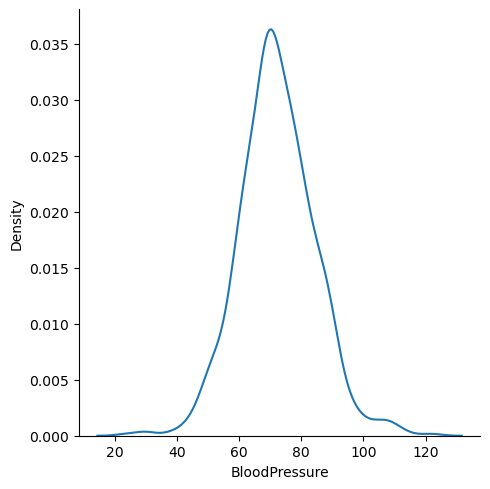
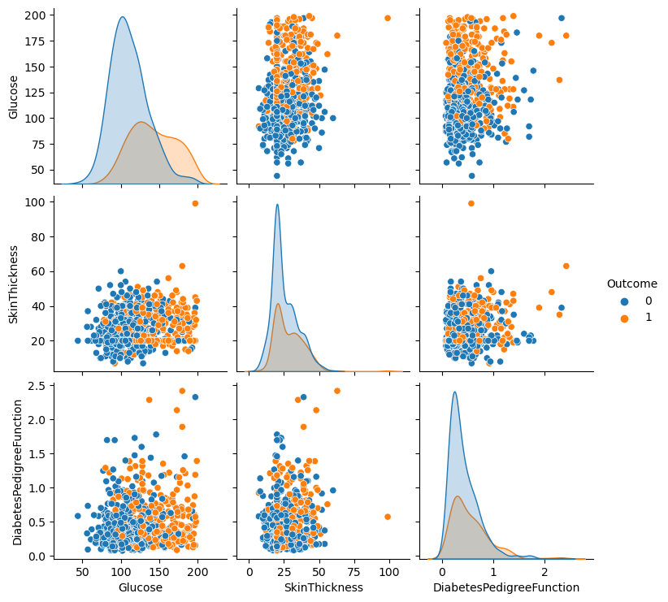
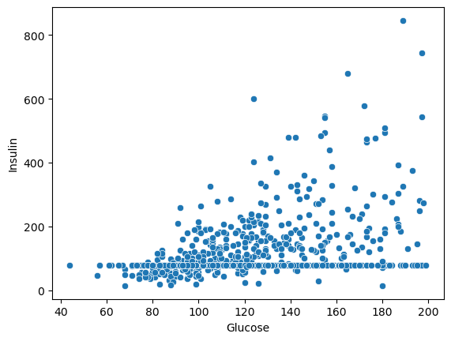
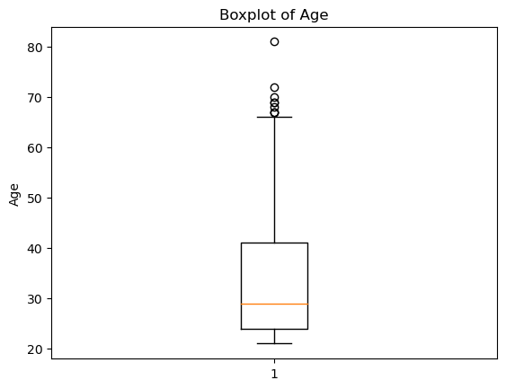
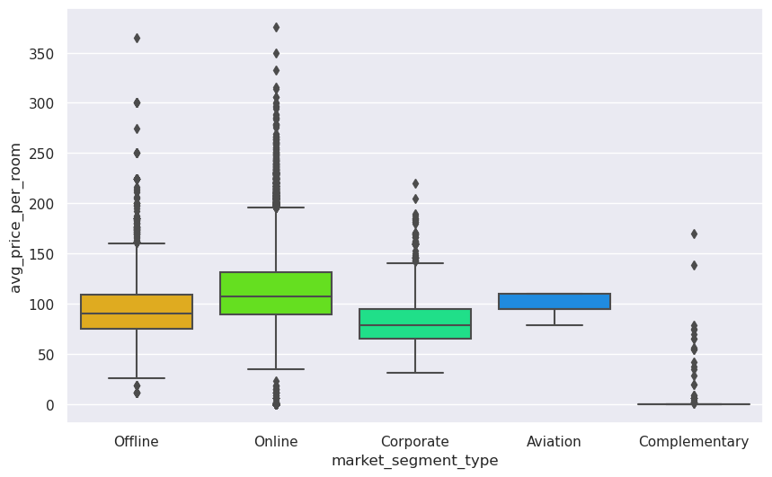
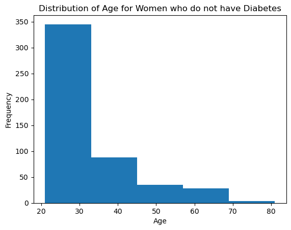
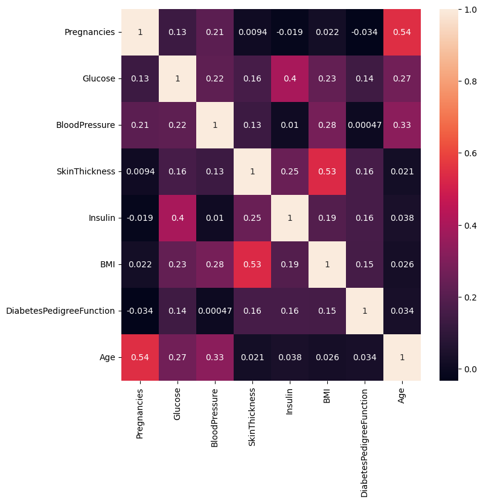

# Davide Sabeddu's Portfolio
*4 main projects:*
* 1: [Python] **Visualization and Statistics** Pima Diabetes Analysis
* 2: [Python] **Classification and Hypothesis Testing** Hotel Booking Cancellation Prediction
* 3: [Python] **Recommendation Systems** Amazon Product Reviews
* 4: [Matlab] **Master's Thesis** Acoustic and Thermal Impacts of
Transcranial Ultrasonic Neuromodulation in Humans


# Foundations of Data Science Project - Diabetes Analysis

---------------
## Context
---------------

Diabetes is one of the most frequent diseases worldwide and the number of diabetic patients are growing over the years. The main cause of diabetes remains unknown, yet scientists believe that both genetic factors and environmental lifestyle play a major role in diabetes.

A few years ago research was done on a tribe in America which is called the Pima tribe (also known as the Pima Indians). In this tribe, it was found that the ladies are prone to diabetes very early. Several constraints were placed on the selection of these instances from a larger database. In particular, all patients were females at least 21 years old of Pima Indian heritage. 

-----------------
## Objective
-----------------

Here, we are analyzing different aspects of Diabetes in the Pima Indians tribe by doing Exploratory Data Analysis.

-------------------------
## Data Dictionary
-------------------------

The dataset has the following information:

* Pregnancies: Number of times pregnant
* Glucose: Plasma glucose concentration over 2 hours in an oral glucose tolerance test
* BloodPressure: Diastolic blood pressure (mm Hg)
* SkinThickness: Triceps skin fold thickness (mm)
* Insulin: 2-Hour serum insulin (mu U/ml)
* BMI: Body mass index (weight in kg/(height in m)^2)
* DiabetesPedigreeFunction: A function that scores the likelihood of diabetes based on family history.
* Age: Age in years
* Outcome: Class variable (0: a person is not diabetic or 1: a person is diabetic)

## Q 1: Import the necessary libraries and briefly explain the use of each library (3 Marks)


```python
# remove _____ & write the appropriate library name

import numpy as np
import pandas as pd

import seaborn as sns
import matplotlib.pyplot as plt
%matplotlib inline
```

#### Write your Answer here: 
Ans 1: Numpy is a library used for mathematical operations with arrays and matrices. Pandas is a library used to extract, manipulate and clean dataframes (datasets). Matplotlib is MATLAB-based library used to visualize data. Seaborn is also a library used for visualization with more elaborated tools compare to Matplotlib.
## Q 2: Read the given dataset (1 Mark)


```python
# remove _____ & write the appropriate function name

pima = pd.read_csv("diabetes.csv")
```

## Q3. Show the last 10 records of the dataset. How many columns are there? (1 Mark)


```python
# remove ______ and write the appropriate number in the function

pima.tail(10)
```


<div>
<style scoped>
    .dataframe tbody tr th:only-of-type {
        vertical-align: middle;
    }

    .dataframe tbody tr th {
        vertical-align: top;
    }

    .dataframe thead th {
        text-align: right;
    }
</style>
<table border="1" class="dataframe">
  <thead>
    <tr style="text-align: right;">
      <th></th>
      <th>Pregnancies</th>
      <th>Glucose</th>
      <th>BloodPressure</th>
      <th>SkinThickness</th>
      <th>Insulin</th>
      <th>BMI</th>
      <th>DiabetesPedigreeFunction</th>
      <th>Age</th>
      <th>Outcome</th>
    </tr>
  </thead>
  <tbody>
    <tr>
      <th>758</th>
      <td>1</td>
      <td>106</td>
      <td>76</td>
      <td>20</td>
      <td>79</td>
      <td>37.5</td>
      <td>0.197</td>
      <td>26</td>
      <td>0</td>
    </tr>
    <tr>
      <th>759</th>
      <td>6</td>
      <td>190</td>
      <td>92</td>
      <td>20</td>
      <td>79</td>
      <td>35.5</td>
      <td>0.278</td>
      <td>66</td>
      <td>1</td>
    </tr>
    <tr>
      <th>760</th>
      <td>2</td>
      <td>88</td>
      <td>58</td>
      <td>26</td>
      <td>16</td>
      <td>28.4</td>
      <td>0.766</td>
      <td>22</td>
      <td>0</td>
    </tr>
    <tr>
      <th>761</th>
      <td>9</td>
      <td>170</td>
      <td>74</td>
      <td>31</td>
      <td>79</td>
      <td>44.0</td>
      <td>0.403</td>
      <td>43</td>
      <td>1</td>
    </tr>
    <tr>
      <th>762</th>
      <td>9</td>
      <td>89</td>
      <td>62</td>
      <td>20</td>
      <td>79</td>
      <td>22.5</td>
      <td>0.142</td>
      <td>33</td>
      <td>0</td>
    </tr>
    <tr>
      <th>763</th>
      <td>10</td>
      <td>101</td>
      <td>76</td>
      <td>48</td>
      <td>180</td>
      <td>32.9</td>
      <td>0.171</td>
      <td>63</td>
      <td>0</td>
    </tr>
    <tr>
      <th>764</th>
      <td>2</td>
      <td>122</td>
      <td>70</td>
      <td>27</td>
      <td>79</td>
      <td>36.8</td>
      <td>0.340</td>
      <td>27</td>
      <td>0</td>
    </tr>
    <tr>
      <th>765</th>
      <td>5</td>
      <td>121</td>
      <td>72</td>
      <td>23</td>
      <td>112</td>
      <td>26.2</td>
      <td>0.245</td>
      <td>30</td>
      <td>0</td>
    </tr>
    <tr>
      <th>766</th>
      <td>1</td>
      <td>126</td>
      <td>60</td>
      <td>20</td>
      <td>79</td>
      <td>30.1</td>
      <td>0.349</td>
      <td>47</td>
      <td>1</td>
    </tr>
    <tr>
      <th>767</th>
      <td>1</td>
      <td>93</td>
      <td>70</td>
      <td>31</td>
      <td>79</td>
      <td>30.4</td>
      <td>0.315</td>
      <td>23</td>
      <td>0</td>
    </tr>
  </tbody>
</table>
</div>


#### Write your Answer here: 

Ans 3: 9 columns
## Q4. Show the first 10 records of the dataset (1 Mark)


```python
# remove _____ & write the appropriate function name and the number of rows to get in the output

pima.head(10)
```


<div>
<style scoped>
    .dataframe tbody tr th:only-of-type {
        vertical-align: middle;
    }

    .dataframe tbody tr th {
        vertical-align: top;
    }

    .dataframe thead th {
        text-align: right;
    }
</style>
<table border="1" class="dataframe">
  <thead>
    <tr style="text-align: right;">
      <th></th>
      <th>Pregnancies</th>
      <th>Glucose</th>
      <th>BloodPressure</th>
      <th>SkinThickness</th>
      <th>Insulin</th>
      <th>BMI</th>
      <th>DiabetesPedigreeFunction</th>
      <th>Age</th>
      <th>Outcome</th>
    </tr>
  </thead>
  <tbody>
    <tr>
      <th>0</th>
      <td>6</td>
      <td>148</td>
      <td>72</td>
      <td>35</td>
      <td>79</td>
      <td>33.600000</td>
      <td>0.627</td>
      <td>50</td>
      <td>1</td>
    </tr>
    <tr>
      <th>1</th>
      <td>1</td>
      <td>85</td>
      <td>66</td>
      <td>29</td>
      <td>79</td>
      <td>26.600000</td>
      <td>0.351</td>
      <td>31</td>
      <td>0</td>
    </tr>
    <tr>
      <th>2</th>
      <td>8</td>
      <td>183</td>
      <td>64</td>
      <td>20</td>
      <td>79</td>
      <td>23.300000</td>
      <td>0.672</td>
      <td>32</td>
      <td>1</td>
    </tr>
    <tr>
      <th>3</th>
      <td>1</td>
      <td>89</td>
      <td>66</td>
      <td>23</td>
      <td>94</td>
      <td>28.100000</td>
      <td>0.167</td>
      <td>21</td>
      <td>0</td>
    </tr>
    <tr>
      <th>4</th>
      <td>0</td>
      <td>137</td>
      <td>40</td>
      <td>35</td>
      <td>168</td>
      <td>43.100000</td>
      <td>2.288</td>
      <td>33</td>
      <td>1</td>
    </tr>
    <tr>
      <th>5</th>
      <td>5</td>
      <td>116</td>
      <td>74</td>
      <td>20</td>
      <td>79</td>
      <td>25.600000</td>
      <td>0.201</td>
      <td>30</td>
      <td>0</td>
    </tr>
    <tr>
      <th>6</th>
      <td>3</td>
      <td>78</td>
      <td>50</td>
      <td>32</td>
      <td>88</td>
      <td>31.000000</td>
      <td>0.248</td>
      <td>26</td>
      <td>1</td>
    </tr>
    <tr>
      <th>7</th>
      <td>10</td>
      <td>115</td>
      <td>69</td>
      <td>20</td>
      <td>79</td>
      <td>35.300000</td>
      <td>0.134</td>
      <td>29</td>
      <td>0</td>
    </tr>
    <tr>
      <th>8</th>
      <td>2</td>
      <td>197</td>
      <td>70</td>
      <td>45</td>
      <td>543</td>
      <td>30.500000</td>
      <td>0.158</td>
      <td>53</td>
      <td>1</td>
    </tr>
    <tr>
      <th>9</th>
      <td>8</td>
      <td>125</td>
      <td>96</td>
      <td>20</td>
      <td>79</td>
      <td>31.992578</td>
      <td>0.232</td>
      <td>54</td>
      <td>1</td>
    </tr>
  </tbody>
</table>
</div>


## Q5. What do you understand by the dimension of the dataset? Find the dimension of the `pima` dataframe. (1 Mark)


```python
# remove _____ & write the appropriate function name

pima.shape
```


    (768, 9)


#### Write your Answer here: 

Ans 5: The dataframe has 768 rows and 9 columns.
## Q6. What do you understand by the size of the dataset? Find the size of the `pima` dataframe. (1 Mark)


```python
# remove _____ & write the appropriate function name

pima.size
```


    6912


#### Write your Answer here: 

Ans 6: 768 rows x 9 columns = 6912 dataframe size.
## Q7. What are the data types of all the variables in the data set? (2 Marks)
**Hint: Use the info() function to get all the information about the dataset.**


```python
# remove _____ & write the appropriate function name

pima.info()
```

    <class 'pandas.core.frame.DataFrame'>
    RangeIndex: 768 entries, 0 to 767
    Data columns (total 9 columns):
     #   Column                    Non-Null Count  Dtype  
    ---  ------                    --------------  -----  
     0   Pregnancies               768 non-null    int64  
     1   Glucose                   768 non-null    int64  
     2   BloodPressure             768 non-null    int64  
     3   SkinThickness             768 non-null    int64  
     4   Insulin                   768 non-null    int64  
     5   BMI                       768 non-null    float64
     6   DiabetesPedigreeFunction  768 non-null    float64
     7   Age                       768 non-null    int64  
     8   Outcome                   768 non-null    int64  
    dtypes: float64(2), int64(7)
    memory usage: 54.1 KB


#### Write your Answer here: 

Ans 7: All variables are numerical. Two are type float (BMI and DiabetesPedigreeFunction), the others are integer type.
## Q8. What do we mean by missing values? Are there any missing values in the `pima` dataframe? (2 Marks)


```python
# remove _____ & write the appropriate function name

pima.isnull().values.any()
```


    False


#### Write your Answer here: 

Ans 8: By missing values we mean that in the dataframe there are cells that do not contain any piece of information. With the above command we check whether pima dataframe has missing values. isnull() is a method that for each cell returns True when the cell is empty. The attribute values returns an array with all the Boolean values. With the method any() we are able to show that there are not missing values in pima because otherwise it would have returned True is any item was True.
## Q9. What do the summary statistics of the data represent? Find the summary statistics for all variables except 'Outcome' in the `pima` data. Take one column/variable from the output table and explain all its statistical measures. (3 Marks)


```python
# remove _____ & write the appropriate function name

pima.iloc[:,0:8].describe()
```


<div>
<style scoped>
    .dataframe tbody tr th:only-of-type {
        vertical-align: middle;
    }

    .dataframe tbody tr th {
        vertical-align: top;
    }

    .dataframe thead th {
        text-align: right;
    }
</style>
<table border="1" class="dataframe">
  <thead>
    <tr style="text-align: right;">
      <th></th>
      <th>Pregnancies</th>
      <th>Glucose</th>
      <th>BloodPressure</th>
      <th>SkinThickness</th>
      <th>Insulin</th>
      <th>BMI</th>
      <th>DiabetesPedigreeFunction</th>
      <th>Age</th>
    </tr>
  </thead>
  <tbody>
    <tr>
      <th>count</th>
      <td>768.000000</td>
      <td>768.000000</td>
      <td>768.000000</td>
      <td>768.000000</td>
      <td>768.000000</td>
      <td>768.000000</td>
      <td>768.000000</td>
      <td>768.000000</td>
    </tr>
    <tr>
      <th>mean</th>
      <td>3.845052</td>
      <td>121.675781</td>
      <td>72.250000</td>
      <td>26.447917</td>
      <td>118.270833</td>
      <td>32.450805</td>
      <td>0.471876</td>
      <td>33.240885</td>
    </tr>
    <tr>
      <th>std</th>
      <td>3.369578</td>
      <td>30.436252</td>
      <td>12.117203</td>
      <td>9.733872</td>
      <td>93.243829</td>
      <td>6.875374</td>
      <td>0.331329</td>
      <td>11.760232</td>
    </tr>
    <tr>
      <th>min</th>
      <td>0.000000</td>
      <td>44.000000</td>
      <td>24.000000</td>
      <td>7.000000</td>
      <td>14.000000</td>
      <td>18.200000</td>
      <td>0.078000</td>
      <td>21.000000</td>
    </tr>
    <tr>
      <th>25%</th>
      <td>1.000000</td>
      <td>99.750000</td>
      <td>64.000000</td>
      <td>20.000000</td>
      <td>79.000000</td>
      <td>27.500000</td>
      <td>0.243750</td>
      <td>24.000000</td>
    </tr>
    <tr>
      <th>50%</th>
      <td>3.000000</td>
      <td>117.000000</td>
      <td>72.000000</td>
      <td>23.000000</td>
      <td>79.000000</td>
      <td>32.000000</td>
      <td>0.372500</td>
      <td>29.000000</td>
    </tr>
    <tr>
      <th>75%</th>
      <td>6.000000</td>
      <td>140.250000</td>
      <td>80.000000</td>
      <td>32.000000</td>
      <td>127.250000</td>
      <td>36.600000</td>
      <td>0.626250</td>
      <td>41.000000</td>
    </tr>
    <tr>
      <th>max</th>
      <td>17.000000</td>
      <td>199.000000</td>
      <td>122.000000</td>
      <td>99.000000</td>
      <td>846.000000</td>
      <td>67.100000</td>
      <td>2.420000</td>
      <td>81.000000</td>
    </tr>
  </tbody>
</table>
</div>


#### Write your Answer here: 

Ans 9: Summary statistics of the data represent descriptive statistics on how the data is distributed across the sample: the mean, standard deviation, minimum, maximum, and quartiles (including median). For example, for the variable Age we have 768 values. 
The mean is around 33 years old and the standard deviation can be approximated by 12. The minimum age is 21 years old while the maximum age is 81. 
25% statistic stands for first quartile and it describes how 25% of age values are between 21 years old and 24 years old.
50% statistic is the median while 75% statistic is the third quartile. That means that IQR (interquartile range) that includes 50% of the age values is between 41 years old and 24 years old (17 years of range).
Because the mean is greater than the median, the data distibution is right skewed.

## Q 10. Plot the distribution plot for the variable 'BloodPressure'. Write detailed observations from the plot. (2 Marks)


```python
# remove _____ & write the appropriate library name

sns.displot(pima['BloodPressure'], kind='kde')
plt.show()
```


    

    


#### Write your Answer here: 

Ans 10: The Blood Pressure distribution is almost symmetrical around the value 70. It tends to a bell-shape form, so the curve is almost a Gaussian curve. Probably the mode is very similar to the mean and median. 
## Q 11. What is the 'BMI' of the person having the highest 'Glucose'? (1 Mark)


```python
# remove _____ & write the appropriate function name

pima[pima['Glucose']==pima['Glucose'].max()]['BMI']
```


    661    42.9
    Name: BMI, dtype: float64


#### Write your Answer here: 

Ans 11: The person with the highest glucose has a Body Mass Index (BMI) of 42.9. According to cdc.gov that person is obese.
## Q12.
### 12.1 What is the mean of the variable 'BMI'? 
### 12.2 What is the median of the variable 'BMI'? 
### 12.3 What is the mode of the variable 'BMI'?
### 12.4 Are the three measures of central tendency equal?

### (3 Marks)


```python
# remove _____ & write the appropriate function name

m1 = pima['BMI'].mean()  # mean
print(m1)
m2 = pima['BMI'].median()  # median
print(m2)
m3 = pima['BMI'].mode()[0]  # mode
print(m3)
```

    32.45080515543617
    32.0
    32.0


#### Write your Answer here: 

Ans 12: The BMI mean is around 32. The median and the mode are also 32. That means that the three measures of central tendency are equal suggesting that the BMI distribution is Gaussian.
## Q13. How many women's 'Glucose' levels are above the mean level of 'Glucose'? (1 Mark)


```python
# remove _____ & write the appropriate function name

pima[pima['Glucose']>pima['Glucose'].mean()].shape[0]
```


    343


#### Write your Answer here: 

Ans 13: In the dataframe 343 Pima women have a glucose level above the mean.
## Q14. How many women have their 'BloodPressure' equal to the median of 'BloodPressure' and their 'BMI' less than the median of 'BMI'? (2 Marks)


```python
# remove _____ & write the appropriate column name

pima[(pima['BloodPressure']==pima['BloodPressure'].median()) & (pima['BMI']<pima['BMI'].median())].shape[0]
```


    22


#### Write your Answer here: 

Ans 14: In the dataframe 22 Pima women have a blood pressure equal to the median value and the BMI smaller than the BMI median.
## Q15. Create a pairplot for the variables 'Glucose', 'SkinThickness', and 'DiabetesPedigreeFunction'. Write your observations from the plot. (4 Marks)


```python
# remove _____ & write the appropriate function name

sns.pairplot(data=pima,vars=['Glucose', 'SkinThickness', 'DiabetesPedigreeFunction'], hue='Outcome')
plt.show()
```


    

    


#### Write your Answer here: 

Ans 15: There are several observations to make. First of all, the glucose distribution of diabetic Pima women can be distinguished from the non-diabetic women distribution. It is harder to distinguish the outcome variable from the skin thickness and diabetes pedigree function distributions. 
At first sight, the glucose does not seem to have a high correlation with the skin thickness. There is a high value on the top right of the graph but it could be an outlier. 
The glucose level has a more positive correlation with the diabetes pedigree function but probably not extremely high. Anyway, both the glucose vs skin thickness and glucose vs pedigree function shows distinguishable sub-groups based on the outcome variable. 
Last, the skinthickness does not seem to have a great correlation with the diabetes pedigree function and the graph does not differentiate very well the outcome variable.
## Q16. Plot the scatterplot between 'Glucose' and 'Insulin'. Write your observations from the plot. (2 Marks)


```python
# remove _____ & write the appropriate function name

sns.scatterplot(x='Glucose',y='Insulin',data=pima)
plt.show()
```


    

    


#### Write your Answer here: 

Ans 16: From this scatterplot we can see how the glucose is positively correlated with the insulin level. However, there is an odd situation when the insulin value is around 100 where it looks like many glucose values correspond to that insuline value. This should be checked more carefully before to end up with conclusions. 
## Q 17. Plot the boxplot for the 'Age' variable. Are there outliers? (2 Marks)


```python
# remove _____ & write the appropriate function and column name 

plt.boxplot(pima['Age'])

plt.title('Boxplot of Age')
plt.ylabel('Age')
plt.show()
```


    

    


#### Write your Answer here: 

Ans 17: Yes, there are outliers and they are all above the value that represents 1.5 times the interquartile range.
## Q18. Plot histograms for the 'Age' variable to understand the number of women in different age groups given whether they have diabetes or not. Explain both histograms and compare them. (3 Marks)


```python
# remove _____ & write the appropriate function and column name

plt.hist(pima[pima['Outcome']==1]['Age'], bins = 5)
plt.title('Distribution of Age for Women who has Diabetes')
plt.xlabel('Age')
plt.ylabel('Frequency')
plt.show()
```


    

    


```python
# remove _____ & write the appropriate function and column name

plt.hist(pima[pima['Outcome']==0]['Age'], bins = 5)
plt.title('Distribution of Age for Women who do not have Diabetes')
plt.xlabel('Age')
plt.ylabel('Frequency')
plt.show()
```


    

    


#### Write your Answer here: 

Ans 18: Both histograms seem to suggest that the age population of non-diabetic Pima women and diabetic Pima women follow an exponential distribution. However, the non-diabetic women sample is more distributed across younger ages compared to the diabetic histogram. In fact, the most common age for non-diabetic women lies in the younger range (around 20-30 years old) while the diabetic women age is more spread out but it keeps a pick for young adulthood. This confirms that Pima women tend to be diagnosed with diabetes early.
Also, the non-diabetic young women might have diabetes when they are older as the first histogram describes but it remains more common to be diagnosed at younger age than older age.

## Q 19. What is the Interquartile Range of all the variables? Why is this used? Which plot visualizes the same? (2 Marks)


```python
# remove _____ & write the appropriate variable name

Q1 = pima.quantile(0.25)
Q3 = pima.quantile(0.75)
IQR = Q3 - Q1
print(IQR)
```

    Pregnancies                  5.0000
    Glucose                     40.5000
    BloodPressure               16.0000
    SkinThickness               12.0000
    Insulin                     48.2500
    BMI                          9.1000
    DiabetesPedigreeFunction     0.3825
    Age                         17.0000
    Outcome                      1.0000
    dtype: float64


#### Write your Answer here: 

Ans 19: The Interquartile Range (IQR) is a descriptive statistic for variability. It represents the interval where 50% of the values are and it includes the median. In other words, from the first quartile to the third quartile. It can be used to detect outliers: a common practice is to check whether the values are within 1.5 times the Interquartile range, otherwise they can be detected as outliers.
The plot to visualize IQR is the boxplot: the actual rectangular figure represents IQR.  
## Q 20. Find and visualize the correlation matrix. Write your observations from the plot. (3 Marks)


```python
# remove _____ & write the appropriate function name and run the code

corr_matrix = pima.iloc[:,0:8].corr()

corr_matrix
```


<div>
<style scoped>
    .dataframe tbody tr th:only-of-type {
        vertical-align: middle;
    }

    .dataframe tbody tr th {
        vertical-align: top;
    }

    .dataframe thead th {
        text-align: right;
    }
</style>
<table border="1" class="dataframe">
  <thead>
    <tr style="text-align: right;">
      <th></th>
      <th>Pregnancies</th>
      <th>Glucose</th>
      <th>BloodPressure</th>
      <th>SkinThickness</th>
      <th>Insulin</th>
      <th>BMI</th>
      <th>DiabetesPedigreeFunction</th>
      <th>Age</th>
    </tr>
  </thead>
  <tbody>
    <tr>
      <th>Pregnancies</th>
      <td>1.000000</td>
      <td>0.128022</td>
      <td>0.208987</td>
      <td>0.009393</td>
      <td>-0.018780</td>
      <td>0.021546</td>
      <td>-0.033523</td>
      <td>0.544341</td>
    </tr>
    <tr>
      <th>Glucose</th>
      <td>0.128022</td>
      <td>1.000000</td>
      <td>0.219765</td>
      <td>0.158060</td>
      <td>0.396137</td>
      <td>0.231464</td>
      <td>0.137158</td>
      <td>0.266673</td>
    </tr>
    <tr>
      <th>BloodPressure</th>
      <td>0.208987</td>
      <td>0.219765</td>
      <td>1.000000</td>
      <td>0.130403</td>
      <td>0.010492</td>
      <td>0.281222</td>
      <td>0.000471</td>
      <td>0.326791</td>
    </tr>
    <tr>
      <th>SkinThickness</th>
      <td>0.009393</td>
      <td>0.158060</td>
      <td>0.130403</td>
      <td>1.000000</td>
      <td>0.245410</td>
      <td>0.532552</td>
      <td>0.157196</td>
      <td>0.020582</td>
    </tr>
    <tr>
      <th>Insulin</th>
      <td>-0.018780</td>
      <td>0.396137</td>
      <td>0.010492</td>
      <td>0.245410</td>
      <td>1.000000</td>
      <td>0.189919</td>
      <td>0.158243</td>
      <td>0.037676</td>
    </tr>
    <tr>
      <th>BMI</th>
      <td>0.021546</td>
      <td>0.231464</td>
      <td>0.281222</td>
      <td>0.532552</td>
      <td>0.189919</td>
      <td>1.000000</td>
      <td>0.153508</td>
      <td>0.025748</td>
    </tr>
    <tr>
      <th>DiabetesPedigreeFunction</th>
      <td>-0.033523</td>
      <td>0.137158</td>
      <td>0.000471</td>
      <td>0.157196</td>
      <td>0.158243</td>
      <td>0.153508</td>
      <td>1.000000</td>
      <td>0.033561</td>
    </tr>
    <tr>
      <th>Age</th>
      <td>0.544341</td>
      <td>0.266673</td>
      <td>0.326791</td>
      <td>0.020582</td>
      <td>0.037676</td>
      <td>0.025748</td>
      <td>0.033561</td>
      <td>1.000000</td>
    </tr>
  </tbody>
</table>
</div>


```python
# remove _____ & write the appropriate function name

plt.figure(figsize=(8,8))
sns.heatmap(corr_matrix, annot = True)

# display the plot
plt.show()
```


    

    


#### Write your Answer here: 

Ans 20: In this heatmap it is evident how the skin thickness is enough highly correlated with the BMI. With the same order of correlation, pregnancies are positively correlated with age. This is obvious because a woman can have more babies if she gets older. The blood pressure is also correlated positively with age and BMI. 
As seen in the answer 15, glucose has very low positive correlation with diabetes pedigree function and skin thickness, but it has a good level of positive correlation with insuline. I think this value could have been even more positive if it wasn't for the odd phenomenon I describe in answer 16. It is also evident the positive correlation of glucose with age and BMI.
In my opinion all the other correlations are not large enough to be significant, or maybe that insignificance is still a piece of information to be verified with further analysis and future studies.

```python

```

