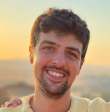
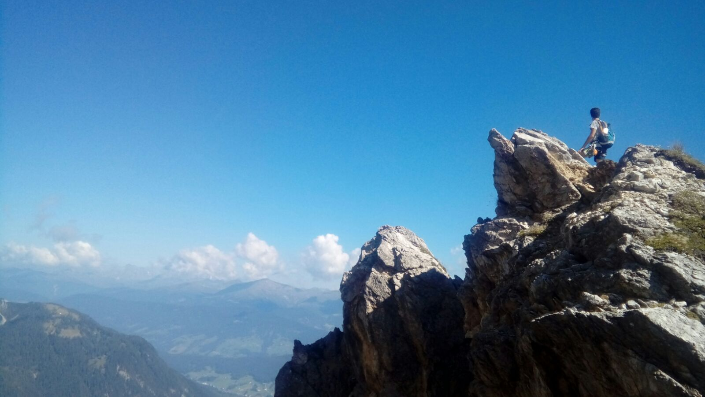

# Welcome!

 

Hello! Thanks for checking out my page!

I'm Davide Sabeddu, **PhD student** at the University of Central Florida. I am a graduate research assistant at the Laboratory for Uncertainty Quantification and Inference [LUQI](https://luqigroup.github.io/), advisor Prof. [Ali Siahkoohi](https://alisiahkoohi.github.io/). 

I was born in 1995 in Sardinia, Italy.
I’m a critical thinker and problem solver with a strong interdisciplinary academic background in Physics and Neuroscience. Driven by a deep interest in applied science, I am very fascinated by understanding human intelligence, how the brain works, the hard problem of consciousness, how and if one day we can reproduce it on machines such as modern computers and robots. I am especially interested in the role of artificial neural networks in this context, as well as in how neuroimaging can be used to advance our understanding of these questions. I approach every challenge with enthusiasm, focus and determination; I don’t stop until I’ve cracked it. I am always ready to roll up my sleeves and tackle challenges head-on to get the job done.

I am drawn to teams that are focused on mentorship and collaboration, where I would be able to learn from senior staff members while contributing through the provision of new insights into current problems. What motivates me most is tackling interdisciplinary problems and by teaching and sharing the insights I gain with others. I thrive in team settings with emotionally intelligent colleagues who understand that the most fruitful outcomes are the product of diverse minds working together toward the common goal of service. I am excited to explore ways in which different fields inform and complement each other in solving issues that are in nature multilateral. 

On this GitHub page you can find:
- **Python projects** from my Data Science and Machine Learning program [2023]
- **MATLAB code** from my Master’s thesis and research internship [2022]

# Technical background
- **Bachelor's in Physics** (Sapienza University of Rome)
- **Master’s in Cognitive Neuroscience** (Radboud University)   
- Familiar with tools like **Git**, **Linux**, **ROS1**, and **LaTeX**
- Programming in Python (NumPy, Pandas, Scikit-learn) and MATLAB 

# International experience
- Research Internship in **ultrasonic brain stimulation** and **acoustic waves simulation** in a **neuromodulation lab** working with a cross-functional team at the Donders Institute for Brain, Cognition and Behavior
- Web Analyst role in Italy managing Agile development teams and supporting public sector clients

# Hobbies
- Gardening
- Hiking
- Board games
- Cooking

# Projects

* 1: [Python] **Visualization and Statistics** [Pima Diabetes Analysis](Project_1_Pima+Indians+Diabetes+Analysis.md)
* 2: [Python] **Classification and Hypothesis Testing** [Hotel Booking Cancellation Prediction](Project_2_Hotel+Booking+Cancellation+Prediction.md)
* 3: [Python] **Recommendation Systems** [Movie Recommendation System](Project_3_Movie+Recommendation.md)
* 4: [MATLAB] **Master's Thesis** [Acoustic/Thermal Impacts of Transcranial Ultrasonic Neuromodulation in Humans](Project_4_Ultrasonic.md)

